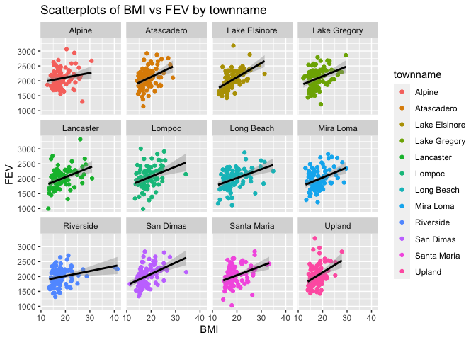
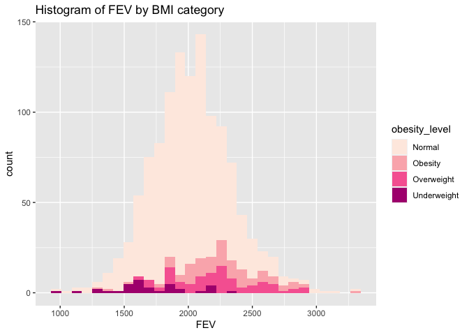
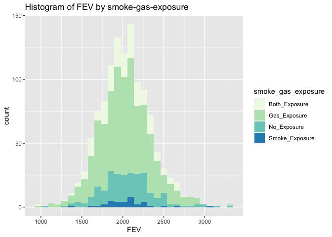
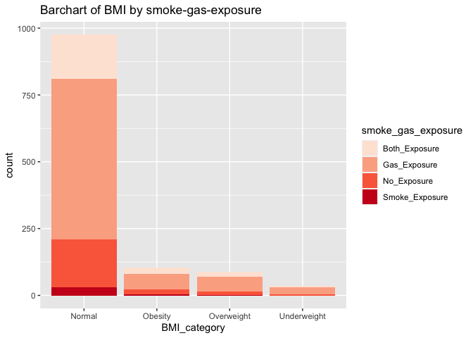
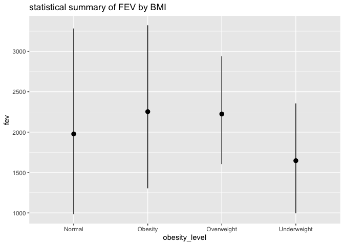
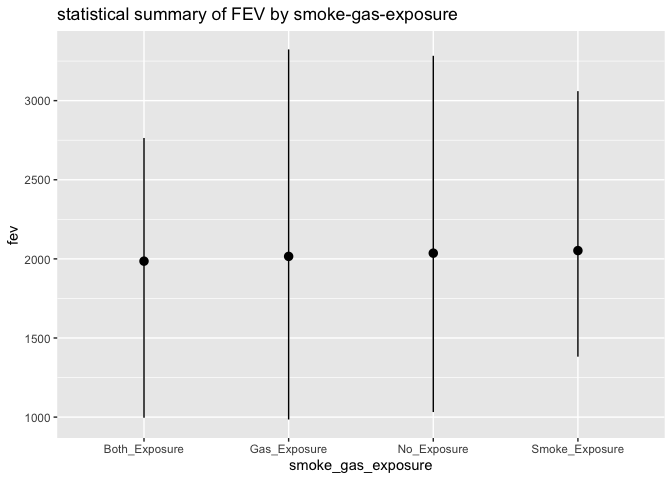
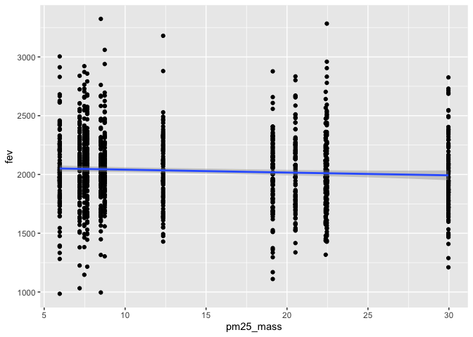

Assignment\_02
================
NickyNie
10/4/2021

# Data Wrangling

## Download data

``` r
ind <- fread("chs_individual.csv")
reg <- fread("chs_regional.csv")
```

## Merge datasets

``` r
data <- merge(
  x = ind,
  y = reg,
  by ="townname",
  all.x = TRUE,
  all.y = FALSE
)
```

## Checking duplications

``` r
dim(ind)
```

    ## [1] 1200   23

``` r
dim(reg)
```

    ## [1] 12 27

``` r
dim(data)
```

    ## [1] 1200   49

No duplication

## Impute NAs

The key variables are bmi, fev, asthma, smoke pm2.5 mass and gasstove,
check for NAs

``` r
sum(is.na(data$bmi))
```

    ## [1] 89

``` r
sum(is.na(data$fev))
```

    ## [1] 95

``` r
sum(is.na(data$smoke))
```

    ## [1] 40

``` r
sum(is.na(data$gasstove))
```

    ## [1] 33

``` r
sum(is.na(data$asthma))
```

    ## [1] 31

``` r
sum(is.na(data$pm25_mass))
```

    ## [1] 0

``` r
data[, m_bmi := mean(bmi, na.rm = TRUE), by = .(male, hispanic)]
data[, bmi := ifelse(is.na(bmi), m_bmi, bmi)]
data[, m_fev := mean(fev, na.rm = TRUE), by = .(male, hispanic)]
data[, fev := ifelse(is.na(fev), m_fev, fev)]
data[, m_smoke := mean(smoke, na.rm = TRUE), by = .(male, hispanic)]
data[, smoke := ifelse(is.na(smoke), m_smoke, smoke)]
data[, m_gas := mean(gasstove, na.rm = TRUE), by = .(male, hispanic)]
data[, gasstove := ifelse(is.na(gasstove), m_gas, gasstove)]
data[, m_asthma := mean(asthma, na.rm = TRUE), by = .(male, hispanic)]
data[, asthma := ifelse(is.na(asthma), m_asthma, asthma)]
sum(is.na(data$bmi))
```

    ## [1] 0

``` r
sum(is.na(data$fev))
```

    ## [1] 0

``` r
sum(is.na(data$smoke))
```

    ## [1] 0

``` r
sum(is.na(data$gasstove))
```

    ## [1] 0

``` r
sum(is.na(data$asthma))
```

    ## [1] 0

## Create obesity level variable using BMI measurement

``` r
data <- data[, obesity_level := fifelse(bmi<14, "Underweight",
                                    fifelse(bmi >= 14  & bmi < 22, "Normal",
                                        fifelse(bmi >= 22 & bmi < 24,"Overweight","Obesity")))]
```

knit a table

``` r
tab <- data[, .(
  Max_BMI = max(bmi),
  Min_BMI = min(bmi),
  Total_Number = .N
), by = obesity_level]

knitr::kable(tab)
```

| obesity\_level | Max\_BMI | Min\_BMI | Total\_Number |
| :------------- | -------: | -------: | ------------: |
| Normal         | 21.96387 | 14.00380 |           975 |
| Overweight     | 23.99650 | 22.02353 |            87 |
| Obesity        | 41.26613 | 24.00647 |           103 |
| Underweight    | 13.98601 | 11.29640 |            35 |

## Create smoke-gas-exposure variable

``` r
data <- data[, smoke_gas_exposure := fifelse(smoke == 0 & gasstove == 0, "No_Exposure",
                                          fifelse(smoke == 1 & gasstove == 0, "Smoke_Exposure",
                                              fifelse(smoke == 0 & gasstove == 1, "Gas_Exposure","Both_Exposure")))]
```

table of town

``` r
tab <- data[, .(
  avg_fev = mean(fev),
  sd_fev = sd(fev),
  avg_asthma = mean(asthma),
  sd_asthma = sd(asthma)
), by = townname]

knitr::kable(tab)
```

| townname      | avg\_fev |  sd\_fev | avg\_asthma | sd\_asthma |
| :------------ | -------: | -------: | ----------: | ---------: |
| Alpine        | 2087.101 | 291.1768 |   0.1144423 |  0.3139348 |
| Atascadero    | 2075.897 | 324.0935 |   0.2528408 |  0.4340107 |
| Lake Elsinore | 2038.849 | 303.6956 |   0.1274366 |  0.3255095 |
| Lake Gregory  | 2084.700 | 319.9593 |   0.1512392 |  0.3585609 |
| Lancaster     | 2003.044 | 317.1298 |   0.1640054 |  0.3674206 |
| Lompoc        | 2034.354 | 351.0454 |   0.1142335 |  0.3139431 |
| Long Beach    | 1985.861 | 319.4625 |   0.1359886 |  0.3370219 |
| Mira Loma     | 1985.202 | 324.9634 |   0.1582359 |  0.3572088 |
| Riverside     | 1989.881 | 277.5065 |   0.1100000 |  0.3144660 |
| San Dimas     | 2026.794 | 318.7845 |   0.1712392 |  0.3771647 |
| Santa Maria   | 2025.750 | 312.1725 |   0.1348240 |  0.3372912 |
| Upland        | 2024.266 | 343.1637 |   0.1212392 |  0.3263737 |

table of sex

``` r
tab <- data[, .(
  avg_fev = mean(fev),
  sd_fev = sd(fev),
  avg_asthma = mean(asthma),
  sd_asthma = sd(asthma)
), by = male]

knitr::kable(tab)
```

| male | avg\_fev |  sd\_fev | avg\_asthma | sd\_asthma |
| ---: | -------: | -------: | ----------: | ---------: |
|    0 | 1958.911 | 311.9181 |   0.1208035 |  0.3224043 |
|    1 | 2103.787 | 307.5123 |   0.1726819 |  0.3728876 |

table of obesity level

``` r
tab <- data[, .(
  avg_fev = mean(fev),
  sd_fev = sd(fev),
  avg_asthma = mean(asthma),
  sd_asthma = sd(asthma)
), by = obesity_level]

knitr::kable(tab)
```

| obesity\_level | avg\_fev |  sd\_fev | avg\_asthma | sd\_asthma |
| :------------- | -------: | -------: | ----------: | ---------: |
| Normal         | 1999.794 | 295.1964 |   0.1403606 |  0.3426863 |
| Overweight     | 2224.322 | 317.4261 |   0.1640991 |  0.3687886 |
| Obesity        | 2266.154 | 325.4710 |   0.2081964 |  0.4034416 |
| Underweight    | 1698.327 | 303.3983 |   0.0857143 |  0.2840286 |

table of smoke\_gas\_exposure

``` r
tab <- data[, .(
  avg_fev = mean(fev),
  sd_fev = sd(fev),
  avg_asthma = mean(asthma),
  sd_asthma = sd(asthma)
), by = smoke_gas_exposure]

knitr::kable(tab)
```

| smoke\_gas\_exposure | avg\_fev |  sd\_fev | avg\_asthma | sd\_asthma |
| :------------------- | -------: | -------: | ----------: | ---------: |
| No\_Exposure         | 2055.356 | 330.4169 |   0.1476213 |  0.3522319 |
| Both\_Exposure       | 2014.752 | 310.5479 |   0.1352076 |  0.3273861 |
| Smoke\_Exposure      | 2055.714 | 295.6475 |   0.1717490 |  0.3768879 |
| Gas\_Exposure        | 2025.989 | 317.6305 |   0.1478616 |  0.3531690 |

# Looking at the data

check for dimension

``` r
dim(data)
```

    ## [1] 1200   56

headers and footers

``` r
head(data)
```

    ##    townname sid male race hispanic    agepft height weight      bmi asthma
    ## 1:   Alpine 835    0    W        0 10.099932    143     69 15.33749      0
    ## 2:   Alpine 838    0    O        1  9.486653    133     62 15.93183      0
    ## 3:   Alpine 839    0    M        1 10.053388    142     86 19.38649      0
    ## 4:   Alpine 840    0    W        0  9.965777    146     78 16.63283      0
    ## 5:   Alpine 841    1    W        1 10.548939    150     78 15.75758      0
    ## 6:   Alpine 842    1    M        1  9.489391    139     65 15.29189      0
    ##    active_asthma father_asthma mother_asthma wheeze hayfever allergy
    ## 1:             0             0             0      0        0       1
    ## 2:             0             0             0      0        0       0
    ## 3:             0             0             1      1        1       1
    ## 4:             0             0             0      0        0       0
    ## 5:             0             0             0      0        0       0
    ## 6:             0             0             0      1        0       0
    ##    educ_parent     smoke pets  gasstove      fev      fvc     mmef pm25_mass
    ## 1:           3 0.0000000    1 0.0000000 2529.276 2826.316 3406.579      8.74
    ## 2:           4 0.1535270    1 0.0000000 1737.793 1963.545 2133.110      8.74
    ## 3:           3 1.0000000    1 0.0000000 2121.711 2326.974 2835.197      8.74
    ## 4:          NA 0.1522989    0 0.7291066 2466.791 2638.221 3466.464      8.74
    ## 5:           5 0.0000000    1 0.0000000 2251.505 2594.649 2445.151      8.74
    ## 6:           1 1.0000000    1 0.0000000 2188.716 2423.934 2524.599      8.74
    ##    pm25_so4 pm25_no3 pm25_nh4 pm25_oc pm25_ec pm25_om pm10_oc pm10_ec pm10_tc
    ## 1:     1.73     1.59     0.88    2.54    0.48    3.04    3.25    0.49    3.75
    ## 2:     1.73     1.59     0.88    2.54    0.48    3.04    3.25    0.49    3.75
    ## 3:     1.73     1.59     0.88    2.54    0.48    3.04    3.25    0.49    3.75
    ## 4:     1.73     1.59     0.88    2.54    0.48    3.04    3.25    0.49    3.75
    ## 5:     1.73     1.59     0.88    2.54    0.48    3.04    3.25    0.49    3.75
    ## 6:     1.73     1.59     0.88    2.54    0.48    3.04    3.25    0.49    3.75
    ##    formic acetic  hcl hno3 o3_max o3106 o3_24   no2  pm10 no_24hr pm2_5_fr
    ## 1:   1.03   2.49 0.41 1.98  65.82 55.05 41.23 12.18 24.73    2.48    10.28
    ## 2:   1.03   2.49 0.41 1.98  65.82 55.05 41.23 12.18 24.73    2.48    10.28
    ## 3:   1.03   2.49 0.41 1.98  65.82 55.05 41.23 12.18 24.73    2.48    10.28
    ## 4:   1.03   2.49 0.41 1.98  65.82 55.05 41.23 12.18 24.73    2.48    10.28
    ## 5:   1.03   2.49 0.41 1.98  65.82 55.05 41.23 12.18 24.73    2.48    10.28
    ## 6:   1.03   2.49 0.41 1.98  65.82 55.05 41.23 12.18 24.73    2.48    10.28
    ##    iacid oacid total_acids       lon      lat    m_bmi    m_fev   m_smoke
    ## 1:  2.39  3.52         5.5 -116.7664 32.83505 18.05281 1945.743 0.1522989
    ## 2:  2.39  3.52         5.5 -116.7664 32.83505 18.63201 1977.241 0.1535270
    ## 3:  2.39  3.52         5.5 -116.7664 32.83505 18.63201 1977.241 0.1535270
    ## 4:  2.39  3.52         5.5 -116.7664 32.83505 18.05281 1945.743 0.1522989
    ## 5:  2.39  3.52         5.5 -116.7664 32.83505 19.41148 2120.266 0.1501976
    ## 6:  2.39  3.52         5.5 -116.7664 32.83505 19.41148 2120.266 0.1501976
    ##        m_gas  m_asthma obesity_level smoke_gas_exposure
    ## 1: 0.7291066 0.1239193        Normal        No_Exposure
    ## 2: 0.8218623 0.1164659        Normal      Both_Exposure
    ## 3: 0.8218623 0.1164659        Normal     Smoke_Exposure
    ## 4: 0.7291066 0.1239193        Normal      Both_Exposure
    ## 5: 0.8156863 0.1601562        Normal        No_Exposure
    ## 6: 0.8156863 0.1601562        Normal     Smoke_Exposure

``` r
tail(data)
```

    ##    townname  sid male race hispanic    agepft height weight      bmi asthma
    ## 1:   Upland 1866    0    O        1  9.806982    139     60 14.11559      0
    ## 2:   Upland 1867    0    M        1  9.618070    140     71 16.46568      0
    ## 3:   Upland 2031    1    W        0  9.798768    135     83 20.70084      0
    ## 4:   Upland 2032    1    W        0  9.549624    137     59 14.28855      0
    ## 5:   Upland 2033    0    M        0 10.121834    130     67 18.02044      0
    ## 6:   Upland 2053    0    W        0        NA     NA     NA 18.05281      0
    ##    active_asthma father_asthma mother_asthma wheeze hayfever allergy
    ## 1:             0            NA             0      0       NA      NA
    ## 2:             0             1             0      0        0       0
    ## 3:             0             0             0      1        0       1
    ## 4:             0             0             1      1        1       1
    ## 5:             1             0             0      1        1       0
    ## 6:             0             0             0      0        0       0
    ##    educ_parent smoke pets gasstove      fev      fvc     mmef pm25_mass
    ## 1:           3     0    1        0 1691.275 1928.859 1890.604     22.46
    ## 2:           3     0    1        0 1733.338 1993.040 2072.643     22.46
    ## 3:           3     0    1        1 2034.177 2505.535 1814.075     22.46
    ## 4:           3     0    1        1 2077.703 2275.338 2706.081     22.46
    ## 5:           3     0    1        1 1929.866 2122.148 2558.054     22.46
    ## 6:           3     0    1        0 1945.743       NA       NA     22.46
    ##    pm25_so4 pm25_no3 pm25_nh4 pm25_oc pm25_ec pm25_om pm10_oc pm10_ec pm10_tc
    ## 1:     2.65     7.75     2.96    6.49    1.19    7.79    8.32    1.22    9.54
    ## 2:     2.65     7.75     2.96    6.49    1.19    7.79    8.32    1.22    9.54
    ## 3:     2.65     7.75     2.96    6.49    1.19    7.79    8.32    1.22    9.54
    ## 4:     2.65     7.75     2.96    6.49    1.19    7.79    8.32    1.22    9.54
    ## 5:     2.65     7.75     2.96    6.49    1.19    7.79    8.32    1.22    9.54
    ## 6:     2.65     7.75     2.96    6.49    1.19    7.79    8.32    1.22    9.54
    ##    formic acetic  hcl hno3 o3_max o3106 o3_24   no2 pm10 no_24hr pm2_5_fr iacid
    ## 1:   2.67   4.73 0.46 4.03  63.83  46.5  22.2 37.97 40.8   18.48    27.73  4.49
    ## 2:   2.67   4.73 0.46 4.03  63.83  46.5  22.2 37.97 40.8   18.48    27.73  4.49
    ## 3:   2.67   4.73 0.46 4.03  63.83  46.5  22.2 37.97 40.8   18.48    27.73  4.49
    ## 4:   2.67   4.73 0.46 4.03  63.83  46.5  22.2 37.97 40.8   18.48    27.73  4.49
    ## 5:   2.67   4.73 0.46 4.03  63.83  46.5  22.2 37.97 40.8   18.48    27.73  4.49
    ## 6:   2.67   4.73 0.46 4.03  63.83  46.5  22.2 37.97 40.8   18.48    27.73  4.49
    ##    oacid total_acids       lon      lat    m_bmi    m_fev   m_smoke     m_gas
    ## 1:   7.4       11.43 -117.6484 34.09751 18.63201 1977.241 0.1535270 0.8218623
    ## 2:   7.4       11.43 -117.6484 34.09751 18.63201 1977.241 0.1535270 0.8218623
    ## 3:   7.4       11.43 -117.6484 34.09751 18.14035 2090.258 0.1949686 0.7798742
    ## 4:   7.4       11.43 -117.6484 34.09751 18.14035 2090.258 0.1949686 0.7798742
    ## 5:   7.4       11.43 -117.6484 34.09751 18.05281 1945.743 0.1522989 0.7291066
    ## 6:   7.4       11.43 -117.6484 34.09751 18.05281 1945.743 0.1522989 0.7291066
    ##     m_asthma obesity_level smoke_gas_exposure
    ## 1: 0.1164659        Normal        No_Exposure
    ## 2: 0.1164659        Normal        No_Exposure
    ## 3: 0.1829653        Normal       Gas_Exposure
    ## 4: 0.1829653        Normal       Gas_Exposure
    ## 5: 0.1239193        Normal       Gas_Exposure
    ## 6: 0.1239193        Normal        No_Exposure

variable

``` r
str(data)
```

    ## Classes 'data.table' and 'data.frame':   1200 obs. of  56 variables:
    ##  $ townname          : chr  "Alpine" "Alpine" "Alpine" "Alpine" ...
    ##  $ sid               : int  835 838 839 840 841 842 843 844 847 849 ...
    ##  $ male              : int  0 0 0 0 1 1 1 1 1 1 ...
    ##  $ race              : chr  "W" "O" "M" "W" ...
    ##  $ hispanic          : int  0 1 1 0 1 1 0 1 0 0 ...
    ##  $ agepft            : num  10.1 9.49 10.05 9.97 10.55 ...
    ##  $ height            : int  143 133 142 146 150 139 149 143 137 147 ...
    ##  $ weight            : int  69 62 86 78 78 65 98 65 69 112 ...
    ##  $ bmi               : num  15.3 15.9 19.4 16.6 15.8 ...
    ##  $ asthma            : num  0 0 0 0 0 ...
    ##  $ active_asthma     : int  0 0 0 0 0 0 0 0 0 0 ...
    ##  $ father_asthma     : int  0 0 0 0 0 0 0 NA 0 1 ...
    ##  $ mother_asthma     : int  0 0 1 0 0 0 0 NA 0 0 ...
    ##  $ wheeze            : int  0 0 1 0 0 1 1 NA 0 1 ...
    ##  $ hayfever          : int  0 0 1 0 0 0 0 NA 0 0 ...
    ##  $ allergy           : int  1 0 1 0 0 0 1 NA 0 1 ...
    ##  $ educ_parent       : int  3 4 3 NA 5 1 3 NA 5 3 ...
    ##  $ smoke             : num  0 0.154 1 0.152 0 ...
    ##  $ pets              : int  1 1 1 0 1 1 1 0 1 1 ...
    ##  $ gasstove          : num  0 0 0 0.729 0 ...
    ##  $ fev               : num  2529 1738 2122 2467 2252 ...
    ##  $ fvc               : num  2826 1964 2327 2638 2595 ...
    ##  $ mmef              : num  3407 2133 2835 3466 2445 ...
    ##  $ pm25_mass         : num  8.74 8.74 8.74 8.74 8.74 8.74 8.74 8.74 8.74 8.74 ...
    ##  $ pm25_so4          : num  1.73 1.73 1.73 1.73 1.73 1.73 1.73 1.73 1.73 1.73 ...
    ##  $ pm25_no3          : num  1.59 1.59 1.59 1.59 1.59 1.59 1.59 1.59 1.59 1.59 ...
    ##  $ pm25_nh4          : num  0.88 0.88 0.88 0.88 0.88 0.88 0.88 0.88 0.88 0.88 ...
    ##  $ pm25_oc           : num  2.54 2.54 2.54 2.54 2.54 2.54 2.54 2.54 2.54 2.54 ...
    ##  $ pm25_ec           : num  0.48 0.48 0.48 0.48 0.48 0.48 0.48 0.48 0.48 0.48 ...
    ##  $ pm25_om           : num  3.04 3.04 3.04 3.04 3.04 3.04 3.04 3.04 3.04 3.04 ...
    ##  $ pm10_oc           : num  3.25 3.25 3.25 3.25 3.25 3.25 3.25 3.25 3.25 3.25 ...
    ##  $ pm10_ec           : num  0.49 0.49 0.49 0.49 0.49 0.49 0.49 0.49 0.49 0.49 ...
    ##  $ pm10_tc           : num  3.75 3.75 3.75 3.75 3.75 3.75 3.75 3.75 3.75 3.75 ...
    ##  $ formic            : num  1.03 1.03 1.03 1.03 1.03 1.03 1.03 1.03 1.03 1.03 ...
    ##  $ acetic            : num  2.49 2.49 2.49 2.49 2.49 2.49 2.49 2.49 2.49 2.49 ...
    ##  $ hcl               : num  0.41 0.41 0.41 0.41 0.41 0.41 0.41 0.41 0.41 0.41 ...
    ##  $ hno3              : num  1.98 1.98 1.98 1.98 1.98 1.98 1.98 1.98 1.98 1.98 ...
    ##  $ o3_max            : num  65.8 65.8 65.8 65.8 65.8 ...
    ##  $ o3106             : num  55 55 55 55 55 ...
    ##  $ o3_24             : num  41.2 41.2 41.2 41.2 41.2 ...
    ##  $ no2               : num  12.2 12.2 12.2 12.2 12.2 ...
    ##  $ pm10              : num  24.7 24.7 24.7 24.7 24.7 ...
    ##  $ no_24hr           : num  2.48 2.48 2.48 2.48 2.48 2.48 2.48 2.48 2.48 2.48 ...
    ##  $ pm2_5_fr          : num  10.3 10.3 10.3 10.3 10.3 ...
    ##  $ iacid             : num  2.39 2.39 2.39 2.39 2.39 2.39 2.39 2.39 2.39 2.39 ...
    ##  $ oacid             : num  3.52 3.52 3.52 3.52 3.52 3.52 3.52 3.52 3.52 3.52 ...
    ##  $ total_acids       : num  5.5 5.5 5.5 5.5 5.5 5.5 5.5 5.5 5.5 5.5 ...
    ##  $ lon               : num  -117 -117 -117 -117 -117 ...
    ##  $ lat               : num  32.8 32.8 32.8 32.8 32.8 ...
    ##  $ m_bmi             : num  18.1 18.6 18.6 18.1 19.4 ...
    ##  $ m_fev             : num  1946 1977 1977 1946 2120 ...
    ##  $ m_smoke           : num  0.152 0.154 0.154 0.152 0.15 ...
    ##  $ m_gas             : num  0.729 0.822 0.822 0.729 0.816 ...
    ##  $ m_asthma          : num  0.124 0.116 0.116 0.124 0.16 ...
    ##  $ obesity_level     : chr  "Normal" "Normal" "Normal" "Normal" ...
    ##  $ smoke_gas_exposure: chr  "No_Exposure" "Both_Exposure" "Smoke_Exposure" "Both_Exposure" ...
    ##  - attr(*, ".internal.selfref")=<externalptr> 
    ##  - attr(*, "sorted")= chr "townname"

key variable

``` r
summary(data$fev)
```

    ##    Min. 1st Qu.  Median    Mean 3rd Qu.    Max. 
    ##   984.8  1827.6  2016.4  2030.1  2223.6  3323.7

``` r
summary(data$bmi)
```

    ##    Min. 1st Qu.  Median    Mean 3rd Qu.    Max. 
    ##   11.30   15.96   17.81   18.50   19.99   41.27

``` r
summary(data$smoke_gas_exposure)
```

    ##    Length     Class      Mode 
    ##      1200 character character

``` r
summary(data$pm25_mass)
```

    ##    Min. 1st Qu.  Median    Mean 3rd Qu.    Max. 
    ##   5.960   7.615  10.545  14.362  20.988  29.970

### Facet plot showing scatterplots with regression lines of BMI vs FEV by “townname”.

``` r
ggplot(
  data[!is.na(bmi)&!is.na(fev)],
  mapping = aes(x = bmi, y = fev, color = townname))+
  geom_point()+
  geom_smooth(method = "lm", color = "black")+
  facet_wrap(~townname)+
  labs(title = "Scatterplots of BMI vs FEV by townname", x = "BMI", y = "FEV")
```

    ## `geom_smooth()` using formula 'y ~ x'

<!-- -->

From the graph, we can see that bmi has a positive association with fev
for all towns. The change in fev is greater in Upland when bmi changes
and least in Alpine.

### Stacked histograms of FEV by BMI category and FEV by smoke/gas exposure. Use different color schemes than the ggplot default.

``` r
ggplot(
  data[!is.na(obesity_level) & !is.na(fev)],
  mapping = aes(x = fev, fill = obesity_level))+
  geom_histogram()+
  labs(title = "Histogram of FEV by BMI category", x = "FEV")+
  scale_fill_brewer(palette = "RdPu")
```

    ## `stat_bin()` using `bins = 30`. Pick better value with `binwidth`.

<!-- --> It seems that for
the category of Normal, it follows a normal distribution and no clear
distribution for other categories.

``` r
ggplot(
  data[!is.na(smoke_gas_exposure) & !is.na(fev)],
  mapping = aes(x = fev, fill = smoke_gas_exposure))+
  geom_histogram()+
  labs(title = "Histogram of FEV by smoke-gas-exposure", x = "FEV")+
  scale_fill_brewer(palette = "GnBu")
```

    ## `stat_bin()` using `bins = 30`. Pick better value with `binwidth`.

<!-- --> In this graph, it
seems that all the the distribution for all the categories is normal
distribution.

### Barchart of BMI by smoke/gas exposure.

``` r
ggplot(
  data[!is.na(smoke_gas_exposure) & !is.na(obesity_level)],
  mapping = aes(x = obesity_level, fill = smoke_gas_exposure))+
  geom_bar()+
  labs(title = "Barchart of BMI by smoke-gas-exposure", x = "BMI_category")+
  scale_fill_brewer(palette = "Reds")
```

<!-- -->

For all bmi categories, the order of number of counts from greater to
smaller is both\_exposure, gas\_exposure, no\_exposure and
smoke\_exposure.

### Statistical summary graphs of FEV by BMI and FEV by smoke/gas exposure category.

``` r
ggplot(
  data[!is.na(fev) & !is.na(obesity_level)],
  mapping = aes(x = obesity_level, y = fev))+
  stat_summary(fun.min = min, fun.max = max, fun = median)+
  labs(title = "statistical summary of FEV by BMI")
```

<!-- -->

The category of normal has a relatively small median but with greatest
range. And for category of overweight, it has a relatively great median
but with a small range.

``` r
ggplot(
  data[!is.na(fev) & !is.na(smoke_gas_exposure)],
  mapping = aes(x = smoke_gas_exposure, y = fev))+
  stat_summary(fun.min = min, fun.max = max, fun = median)+
  labs(title = "statistical summary of FEV by smoke-gas-exposure")
```

<!-- -->

It seems that based on exposure categories, the medians are almost same
for all of them.

### A leaflet map showing the concentrations of PM2.5 mass in each of the CHS communities.

``` r
pal = colorNumeric(c('green','red'), domain=data$pm25_mass)
#leaflet(data)%>%
#  addProviderTiles('CartoDB.Positron')%>%
#  addCircles(lat =~ lat, lng =~ lon, color =~ pal(pm25_mass), opacity=1, fillOpacity=1, radius=500)%>%
#  addLegend("bottomleft", pal = pal, values = data$pm25_mass, title="concentration of PM2.5 Mass in each communities", opacity=1)
```

The pm2.5 mass is radial centered and greatest around Riverside,
probably because of the mountain fire.

### Choose a visualization to examine whether PM2.5 mass is associated with FEV.

``` r
ggplot(
  data[!is.na(pm25_mass)&!is.na(fev)],
  mapping = aes(x = pm25_mass, y = fev))+
  geom_point()+
  geom_smooth()
```

    ## `geom_smooth()` using method = 'gam' and formula 'y ~ s(x, bs = "cs")'

<!-- -->

I think there is no association between fev and pm2.5 mass
