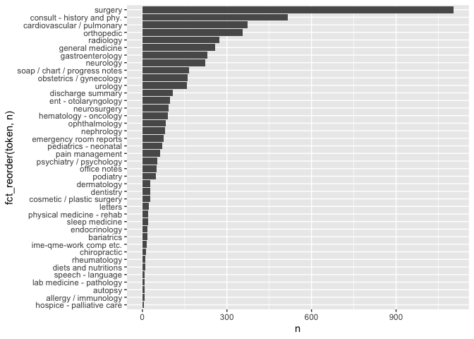
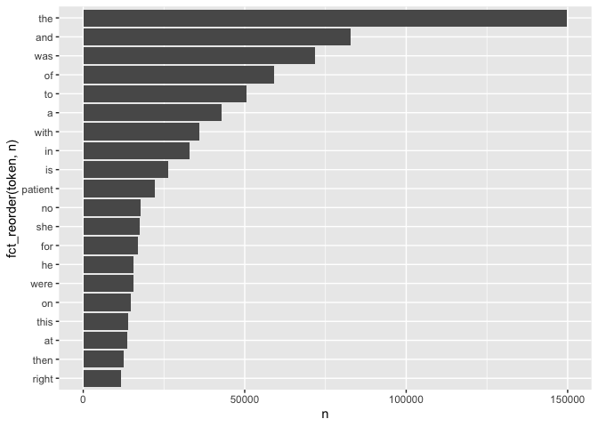
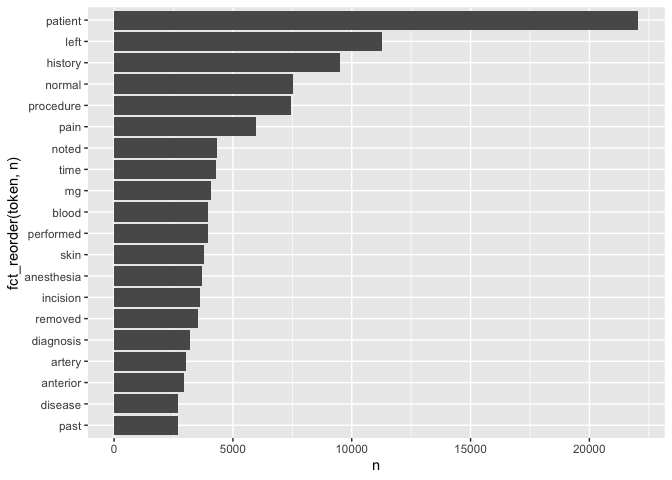
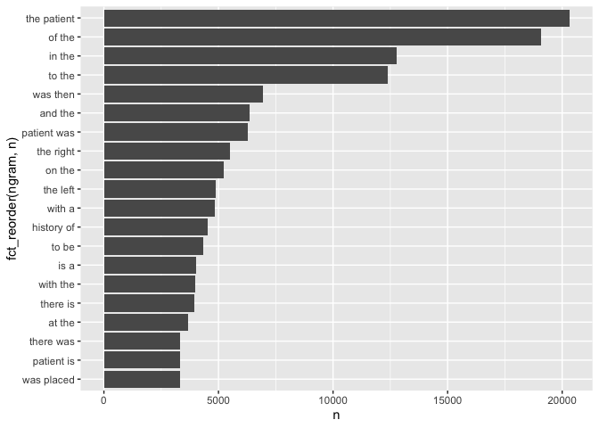
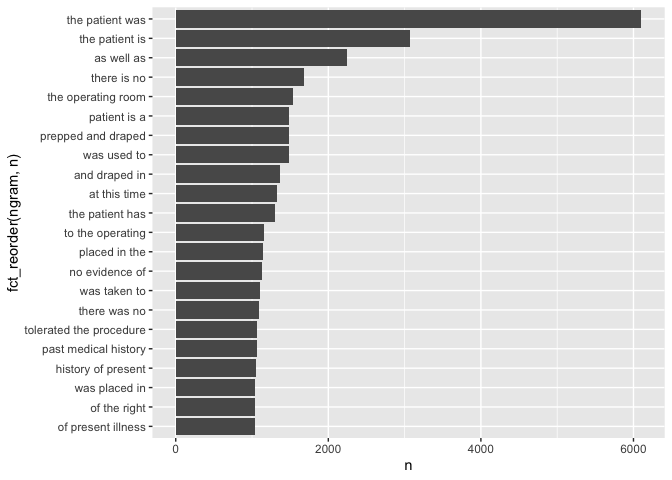

Lab\_06
================
NickyNie
10/1/2021

``` r
library(dplyr)
library(tidytext)
library(tidyverse)
library(tidyr)
```

## Load data

``` r
med_trans <- read.csv("https://raw.githubusercontent.com/USCbiostats/data-science-data/master/00_mtsamples/mtsamples.csv") 
```

# Question 1

``` r
med_trans %>%
  unnest_tokens(token, medical_specialty, token = "sentences") %>%
  count(token) %>%
  ggplot(aes(n, fct_reorder(token, n)))+
  geom_col()
```

<!-- -->

We have 40 categories and they are not evenly distributed. I think some
of them may have some interrelationship and no overlapping is found.

# Question 2

``` r
med_trans %>%
  unnest_tokens(token, transcription, token = "words") %>%
  count(token, sort = TRUE) %>%
  top_n(20,n) %>%
  ggplot(aes(n, fct_reorder(token, n)))+
  geom_col()
```

<!-- -->

The top frequent words are some link words which may not be useful in
our analysis or training, hence anti\_join of stop words should be used
in these data.

# Question 3

``` r
# The method to remove numbers I considered before the lab
number <- as.character(c(0:100))
num <- data.frame(number)
med_trans %>%
  unnest_tokens(token, transcription, token = "words") %>%
  anti_join(stop_words, by = c("token" = "word")) %>%
  anti_join(num, by = c("token" = "number")) %>%
  # method to remove numbers in lab
  # filter(!grepl(pattern = "^[0-9]+$", x = word))
  count(token, sort = TRUE) %>%
  top_n(20,n) %>%
  ggplot(aes(n, fct_reorder(token, n)))+
  geom_col()
```

<!-- -->

The link words and numbers(I set numbers from 0 to 100) all disappear in
my graph of top 20 frequently used words. All the words listed here give
us a more clear insight about the text since words like “patients”
“diagnosis” refer to something in medical records.

# Question 4

## bigrams

``` r
med_trans %>%
  unnest_ngrams(ngram, transcription, n = 2) %>%
  count(ngram, sort = TRUE) %>%
  top_n(20,n) %>%
  ggplot(aes(n, fct_reorder(ngram, n)))+
  geom_col()
```

<!-- --> 

## trigrams

``` r
med_trans %>%
  unnest_ngrams(ngram, transcription, n = 3) %>%
  count(ngram, sort = TRUE) %>%
  top_n(20,n) %>%
  ggplot(aes(n, fct_reorder(ngram, n)))+
  geom_col()
```

<!-- -->

A lot of prepositions phrases such as “of the” “in the” “to the” are not
in the top rank of most frequently used phrases any more.

# Question 5

``` r
bigram <- med_trans %>%
  unnest_ngrams(bigram, transcription, n = 2)%>%
  separate (bigram, into = c("word1", "word2"), sep = " ")
```

``` r
bigram %>%
  select(word1, word2) %>%
  filter(word1 == "history") %>%
  filter(!(word2 %in% stop_words$word) & !grepl(pattern = "^[0-9]+$", word2)) %>%
  count(word2, sort =TRUE)
```

    ##                word2   n
    ## 1        significant 200
    ## 2    noncontributory 121
    ## 3            patient 101
    ## 4           negative  96
    ## 5           positive  87
    ## 6       unremarkable  53
    ## 7       hypertension  50
    ## 8           includes  47
    ## 9             mother  43
    ## 10           history  42
    ## 11          reviewed  34
    ## 12          diabetes  32
    ## 13            social  31
    ## 14            denies  29
    ## 15            family  27
    ## 16              past  26
    ## 17            father  25
    ## 18        remarkable  25
    ## 19           unknown  22
    ## 20          coronary  21
    ## 21    nonsignificant  17
    ## 22       essentially  16
    ## 23                ms  15
    ## 24         pertinent  15
    ## 25          physical  15
    ## 26      appendectomy  14
    ## 27            asthma  13
    ## 28            review  13
    ## 29   cholecystectomy  12
    ## 30             lives  12
    ## 31       medications  12
    ## 32          obtained  10
    ## 33             prior  10
    ## 34            status  10
    ## 35            hernia   9
    ## 36           include   9
    ## 37           notable   9
    ## 38         pulmonary   9
    ## 39     questionnaire   9
    ## 40            strong   9
    ## 41            atrial   8
    ## 42         bilateral   8
    ## 43            denied   8
    ## 44              left   8
    ## 45           marital   8
    ## 46           married   8
    ## 47           related   8
    ## 48         surgeries   8
    ## 49              born   7
    ## 50              copd   7
    ## 51             dates   7
    ## 52           gravida   7
    ## 53        metastatic   7
    ## 54           parents   7
    ## 55           surgery   7
    ## 56              turp   7
    ## 57         childhood   6
    ## 58         including   6
    ## 59            parent   6
    ## 60           reveals   6
    ## 61         unchanged   6
    ## 62               abc   5
    ## 63              baby   5
    ## 64              date   5
    ## 65              form   5
    ## 66      hysterectomy   5
    ## 67             lower   5
    ## 68             noted   5
    ## 69         patient's   5
    ## 70          surgical   5
    ## 71            taking   5
    ## 72                af   4
    ## 73                av   4
    ## 74         basically   4
    ## 75           chronic   4
    ## 76         discussed   4
    ## 77               due   4
    ## 78         extensive   4
    ## 79              foot   4
    ## 80         illnesses   4
    ## 81            listed   4
    ## 82          maternal   4
    ## 83               mom   4
    ## 84          multiple   4
    ## 85         pregnancy   4
    ## 86          prostate   4
    ## 87          provided   4
    ## 88            reason   4
    ## 89          reflects   4
    ## 90          remained   4
    ## 91        suggestive   4
    ## 92          symptoms   4
    ## 93     tonsillectomy   4
    ## 94             tubal   4
    ## 95            unable   4
    ## 96      unobtainable   4
    ## 97              adhd   3
    ## 98           ascites   3
    ## 99         beginning   3
    ## 100          cardiac   3
    ## 101     circumcision   3
    ## 102            colon   3
    ## 103              dad   3
    ## 104               g1   3
    ## 105          gastric   3
    ## 106       historical   3
    ## 107       huntington   3
    ## 108    immunizations   3
    ## 109     longstanding   3
    ## 110           lumbar   3
    ## 111             mild   3
    ## 112     nonoperative   3
    ## 113        nonsmoker   3
    ## 114           noting   3
    ## 115         paternal   3
    ## 116             peho   3
    ## 117        performed   3
    ## 118        placement   3
    ## 119       reportedly   3
    ## 120         sciatica   3
    ## 121              xyz   3
    ## 122         abnormal   2
    ## 123           active   2
    ## 124         advanced   2
    ## 125             af's   2
    ## 126         allergic   2
    ## 127        allergies   2
    ## 128           anemia   2
    ## 129          anxiety   2
    ## 130         aplastic   2
    ## 131        arthritis   2
    ## 132     arthroscopic   2
    ## 133      atelectasis   2
    ## 134            based   2
    ## 135           benign   2
    ## 136          briefly   2
    ## 137          brother   2
    ## 138              cad   2
    ## 139          central   2
    ## 140         cesarean   2
    ## 141            chest   2
    ## 142       compatible   2
    ## 143       consistent   2
    ## 144       consisting   2
    ## 145           cookie   2
    ## 146         cosmetic   2
    ## 147       craniotomy   2
    ## 148          current   2
    ## 149             cyst   2
    ## 150            daily   2
    ## 151         detailed   2
    ## 152          details   2
    ## 153  developmentally   2
    ## 154       diagnostic   2
    ## 155          distant   2
    ## 156               dm   2
    ## 157     dysrhythmias   2
    ## 158           eczema   2
    ## 159         elevated   2
    ## 160         episodic   2
    ## 161        essential   2
    ## 162       excisional   2
    ## 163         father's   2
    ## 164           female   2
    ## 165         findings   2
    ## 166               g3   2
    ## 167      gallbladder   2
    ## 168 gastrointestinal   2
    ## 169    genitourinary   2
    ## 170             gerd   2
    ## 171      grandmother   2
    ## 172             half   2
    ## 173          hearing   2
    ## 174            heart   2
    ## 175        hepatitis   2
    ## 176              hip   2
    ## 177              hiv   2
    ## 178              htn   2
    ## 179   hyperlipidemia   2
    ## 180       impression   2
    ## 181         included   2
    ## 182        inpatient   2
    ## 183              ivc   2
    ## 184             knee   2
    ## 185               l5   2
    ## 186       laboratory   2
    ## 187          limited   2
    ## 188              lmp   2
    ## 189       lumpectomy   2
    ## 190      menorrhagia   2
    ## 191               mi   2
    ## 192  musculoskeletal   2
    ## 193       neurologic   2
    ## 194               ob   2
    ## 195          obesity   2
    ## 196   osteoarthritis   2
    ## 197             pain   2
    ## 198     palpitations   2
    ## 199        parkinson   2
    ## 200           pelvic   2
    ## 201         permcath   2
    ## 202         personal   2
    ## 203    plagiocephaly   2
    ## 204         possibly   2
    ## 205         previous   2
    ## 206         probable   2
    ## 207     psychosocial   2
    ## 208             ptsd   2
    ## 209     questionable   2
    ## 210             quit   2
    ## 211         reactive   2
    ## 212           recent   2
    ## 213          records   2
    ## 214            refer   2
    ## 215            renal   2
    ## 216          resided   2
    ## 217      respiratory   2
    ## 218             rule   2
    ## 219        screening   2
    ## 220         seasonal   2
    ## 221         seizures   2
    ## 222            sheet   2
    ## 223            shone   2
    ## 224        shortness   2
    ## 225         shoulder   2
    ## 226           sister   2
    ## 227         smoke’s   2
    ## 228           smokes   2
    ## 229          smoking   2
    ## 230      spontaneous   2
    ## 231         strongly   2
    ## 232        substance   2
    ## 233          suggest   2
    ## 234       surgically   2
    ## 235          tobacco   2
    ## 236     tuberculosis   2
    ## 237        underwent   2
    ## 238       unemployed   2
    ## 239         ureteral   2
    ## 240          uterine   2
    ## 241            vital   2
    ## 242             abcd   1
    ## 243   adenocarcinoma   1
    ## 244       biological   1
    ## 245         caffeine   1
    ## 246            edema   1
    ## 247          femoral   1
    ## 248            fever   1
    ## 249          genetic   1
    ## 250   hepatocellular   1
    ## 251          medical   1
    ## 252             mone   1
    ## 253           peptic   1
    ## 254            plans   1
    ## 255          steroid   1
    ## 256       subjective   1
    ## 257          summary   1
    ## 258        treatment   1

``` r
bigram %>%
  select(word1, word2) %>%
  filter(word2 == "history") %>%
  filter(!(word1 %in% stop_words$word) & !grepl(pattern = "^[0-9]+$", word1)) %>%
  count(word1, sort =TRUE)
```

    ##                  word1    n
    ## 1              medical 1223
    ## 2               family  941
    ## 3               social  865
    ## 4             surgical  491
    ## 5                 pain   98
    ## 6          psychiatric   90
    ## 7                prior   87
    ## 8                 past   80
    ## 9             previous   72
    ## 10            personal   55
    ## 11            clinical   52
    ## 12             history   42
    ## 13               month   35
    ## 14                 day   32
    ## 15           patient's   31
    ## 16       developmental   29
    ## 17             disease   29
    ## 18             smoking   29
    ## 19              remote   27
    ## 20                week   27
    ## 21               local   24
    ## 22             cardiac   23
    ## 23                diet   23
    ## 24        longstanding   23
    ## 25              cancer   21
    ## 26                foot   21
    ## 27               birth   20
    ## 28          medication   20
    ## 29             factors   18
    ## 30               legal   18
    ## 31              recent   18
    ## 32             alcohol   17
    ## 33             failure   17
    ## 34        hypertension   17
    ## 35              denies   16
    ## 36            contrast   15
    ## 37                 std   14
    ## 38             surgery   14
    ## 39                  cc   13
    ## 40            complete   13
    ## 41            interval   13
    ## 42               abuse   12
    ## 43           diagnosis   12
    ## 44                 gyn   12
    ## 45         significant   12
    ## 46               fever   11
    ## 47        neurological   11
    ## 48             patient   11
    ## 49            standing   11
    ## 50                days   10
    ## 51             distant   10
    ## 52              ocular   10
    ## 53              travel   10
    ## 54               adult    9
    ## 55              denied    9
    ## 56                 iii    9
    ## 57                 ago    8
    ## 58             allergy    8
    ## 59              biopsy    8
    ## 60               bleed    8
    ## 61             chronic    8
    ## 62            lymphoma    8
    ## 63                  mi    8
    ## 64            position    8
    ## 65              sepsis    8
    ## 66            stenosis    8
    ## 67          ultrasound    8
    ## 68            vomiting    8
    ## 69              anemia    7
    ## 70             current    7
    ## 71            fracture    7
    ## 72              health    7
    ## 73                knee    7
    ## 74         nutritional    7
    ## 75         obstetrical    7
    ## 76              status    7
    ## 77              trauma    7
    ## 78               abc's    6
    ## 79           allergies    6
    ## 80              breath    6
    ## 81          depression    6
    ## 82              eating    6
    ## 83          evaluation    6
    ## 84        fibrillation    6
    ## 85            findings    6
    ## 86            followup    6
    ## 87       gynecological    6
    ## 88           hematuria    6
    ## 89        immunization    6
    ## 90             minutes    6
    ## 91             natural    6
    ## 92       psychological    6
    ## 93        questionable    6
    ## 94             syncope    6
    ## 95           treatment    6
    ## 96               tumor    6
    ## 97            weakness    6
    ## 98               weeks    6
    ## 99           admission    5
    ## 100           bleeding    5
    ## 101            complex    5
    ## 102              cough    5
    ## 103           daughter    5
    ## 104               drug    5
    ## 105               home    5
    ## 106               hour    5
    ## 107     hyperlipidemia    5
    ## 108         infarction    5
    ## 109      insufficiency    5
    ## 110           military    5
    ## 111                 ob    5
    ## 112             pelvis    5
    ## 113          pertinent    5
    ## 114           positive    5
    ## 115              thigh    5
    ## 116             weight    5
    ## 117           accurate    4
    ## 118          afternoon    4
    ## 119         anesthetic    4
    ## 120                arm    4
    ## 121          breathing    4
    ## 122          carcinoma    4
    ## 123     cardiovascular    4
    ## 124         cellulitis    4
    ## 125            checkup    4
    ## 126              chest    4
    ## 127       circumcision    4
    ## 128          complaint    4
    ## 129            consent    4
    ## 130         deficiency    4
    ## 131       dermatologic    4
    ## 132           diabetic    4
    ## 133          diagnoses    4
    ## 134          diaphragm    4
    ## 135           dictated    4
    ## 136        educational    4
    ## 137             filter    4
    ## 138                 gi    4
    ## 139           headache    4
    ## 140              heent    4
    ## 141     hypothyroidism    4
    ## 142             injury    4
    ## 143            interim    4
    ## 144           lethargy    4
    ## 145          mammogram    4
    ## 146         management    4
    ## 147           maternal    4
    ## 148        medications    4
    ## 149             mother    4
    ## 150    musculoskeletal    4
    ## 151         neurologic    4
    ## 152         patient’s    4
    ## 153           physical    4
    ## 154           prostate    4
    ## 155               rash    4
    ## 156           reported    4
    ## 157          resolving    4
    ## 158           seizures    4
    ## 159              sleep    4
    ## 160             stable    4
    ## 161             toilet    4
    ## 162          toothache    4
    ## 163              ulcer    4
    ## 164         underlying    4
    ## 165              urine    4
    ## 166           abraxane    3
    ## 167            abscess    3
    ## 168           academic    3
    ## 169           accident    3
    ## 170         additional    3
    ## 171         adjustment    3
    ## 172               bait    3
    ## 173            bedside    3
    ## 174             breast    3
    ## 175       chemotherapy    3
    ## 176 cholangiocarcinoma    3
    ## 177      ciprofloxacin    3
    ## 178            colitis    3
    ## 179        compression    3
    ## 180               cord    3
    ## 181           coumadin    3
    ## 182         counseling    3
    ## 183               cpap    3
    ## 184  craniopharyngioma    3
    ## 185                cva    3
    ## 186              daily    3
    ## 187           detailed    3
    ## 188           earaches    3
    ## 189           economic    3
    ## 190            ecstasy    3
    ## 191           elevated    3
    ## 192     encephalopathy    3
    ## 193          extension    3
    ## 194           familial    3
    ## 195         functional    3
    ## 196        gastrostomy    3
    ## 197              heads    3
    ## 198              heavy    3
    ## 199           hospital    3
    ## 200           insomnia    3
    ## 201    instrumentation    3
    ## 202            jerking    3
    ## 203             joints    3
    ## 204         laceration    3
    ## 205            lesions    3
    ## 206              meals    3
    ## 207              media    3
    ## 208                 mg    3
    ## 209           negative    3
    ## 210     osteoarthritis    3
    ## 211       paracentesis    3
    ## 212               plan    3
    ## 213          pneumonia    3
    ## 214          potential    3
    ## 215             pounds    3
    ## 216     preoperatively    3
    ## 217           pressure    3
    ## 218             rashes    3
    ## 219            refills    3
    ## 220           relevant    3
    ## 221        requirement    3
    ## 222                 s1    3
    ## 223          screening    3
    ## 224            seizure    3
    ## 225             strong    3
    ## 226            support    3
    ## 227           syndrome    3
    ## 228        temperature    3
    ## 229   thrombocytopenia    3
    ## 230                toe    3
    ## 231               toes    3
    ## 232        transfusion    3
    ## 233         transplant    3
    ## 234               tube    3
    ## 235            urinate    3
    ## 236              vague    3
    ## 237         xerostomia    3
    ## 238           acromion    2
    ## 239       adenosarcoma    2
    ## 240        anesthetics    2
    ## 241             angina    2
    ## 242              ankle    2
    ## 243            anxiety    2
    ## 244              apnea    2
    ## 245        appointment    2
    ## 246             artery    2
    ## 247       arthroplasty    2
    ## 248         assessment    2
    ## 249           azotemia    2
    ## 250         bacteremia    2
    ## 251           biopsies    2
    ## 252            bladder    2
    ## 253                bnp    2
    ## 254              brace    2
    ## 255              bursa    2
    ## 256             button    2
    ## 257           calculus    2
    ## 258           cataract    2
    ## 259              cecum    2
    ## 260              check    2
    ## 261          childhood    2
    ## 262          cirrhosis    2
    ## 263           clearcut    2
    ## 264                cns    2
    ## 265      complications    2
    ## 266          component    2
    ## 267          condition    2
    ## 268         conditions    2
    ## 269            condyle    2
    ## 270            consult    2
    ## 271       consultation    2
    ## 272               copd    2
    ## 273              cycle    2
    ## 274         cystoscopy    2
    ## 275         defecation    2
    ## 276             deflux    2
    ## 277           delivery    2
    ## 278           dementia    2
    ## 279         department    2
    ## 280          describes    2
    ## 281        development    2
    ## 282         disability    2
    ## 283         discovered    2
    ## 284               disk    2
    ## 285        disturbance    2
    ## 286               dome    2
    ## 287           drainage    2
    ## 288               drip    2
    ## 289              drops    2
    ## 290              drugs    2
    ## 291          duramorph    2
    ## 292                eeg    2
    ## 293           effusion    2
    ## 294                ekg    2
    ## 295           embolism    2
    ## 296          emphysema    2
    ## 297        epilepticus    2
    ## 298      erythematosus    2
    ## 299        established    2
    ## 300               exam    2
    ## 301            examine    2
    ## 302           exposure    2
    ## 303               fall    2
    ## 304             father    2
    ## 305           father's    2
    ## 306               ffdm    2
    ## 307              floor    2
    ## 308            flutter    2
    ## 309           foreskin    2
    ## 310          frequency    2
    ## 311           function    2
    ## 312          gastritis    2
    ## 313               gerd    2
    ## 314              glans    2
    ## 315             glioma    2
    ## 316                 gu    2
    ## 317        gynecologic    2
    ## 318     hallucinations    2
    ## 319             height    2
    ## 320        hematologic    2
    ## 321        hemiparesis    2
    ## 322         hemoptysis    2
    ## 323             heroin    2
    ## 324         hoarseness    2
    ## 325              hours    2
    ## 326                hpi    2
    ## 327     hydronephrosis    2
    ## 328   hypersensitivity    2
    ## 329        hypertrophy    2
    ## 330        hypotension    2
    ## 331          hypoxemia    2
    ## 332       hysterectomy    2
    ## 333             images    2
    ## 334         immaturity    2
    ## 335        immunologic    2
    ## 336          impaction    2
    ## 337           impaired    2
    ## 338         impression    2
    ## 339          including    2
    ## 340          infection    2
    ## 341         injections    2
    ## 342                inr    2
    ## 343        instability    2
    ## 344             intact    2
    ## 345      interrogation    2
    ## 346         irritation    2
    ## 347           jaundice    2
    ## 348             kidney    2
    ## 349           kyphosis    2
    ## 350               left    2
    ## 351                leg    2
    ## 352               legs    2
    ## 353           lifelong    2
    ## 354           ligation    2
    ## 355              liver    2
    ## 356           marcaine    2
    ## 357         mastectomy    2
    ## 358           mellitus    2
    ## 359       mesothelioma    2
    ## 360          metabolic    2
    ## 361         metastases    2
    ## 362               mgus    2
    ## 363         monitoring    2
    ## 364             murmur    2
    ## 365           mutation    2
    ## 366             niacin    2
    ## 367              night    2
    ## 368            nodosum    2
    ## 369            nodules    2
    ## 370       noncompliant    2
    ## 371     nonoperatively    2
    ## 372             normal    2
    ## 373        obstruction    2
    ## 374       occupational    2
    ## 375               odor    2
    ## 376             office    2
    ## 377            ongoing    2
    ## 378             origin    2
    ## 379      osteomyelitis    2
    ## 380               pacu    2
    ## 381        palpitation    2
    ## 382       palpitations    2
    ## 383              panel    2
    ## 384                pap    2
    ## 385            patella    2
    ## 386           pectoris    2
    ## 387              penis    2
    ## 388             period    2
    ## 389            periods    2
    ## 390          placement    2
    ## 391       polymyositis    2
    ## 392             polyps    2
    ## 393       presentation    2
    ## 394       preventative    2
    ## 395            profile    2
    ## 396              prone    2
    ## 397             proper    2
    ## 398            provide    2
    ## 399        psychologic    2
    ## 400          psychosis    2
    ## 401          pulmonary    2
    ## 402               rate    2
    ## 403             rectum    2
    ## 404            related    2
    ## 405            relates    2
    ## 406            removal    2
    ## 407            reports    2
    ## 408           resolved    2
    ## 409          retention    2
    ## 410        retinopathy    2
    ## 411           reversed    2
    ## 412                sac    2
    ## 413                sbp    2
    ## 414               scan    2
    ## 415        sensitivity    2
    ## 416                sex    2
    ## 417             sexual    2
    ## 418          shakiness    2
    ## 419              shaky    2
    ## 420              short    2
    ## 421              shunt    2
    ## 422            sinuses    2
    ## 423          sinusitis    2
    ## 424           sister's    2
    ## 425      socioeconomic    2
    ## 426              spine    2
    ## 427             sprain    2
    ## 428              staff    2
    ## 429           stenting    2
    ## 430          stiffness    2
    ## 431             stroke    2
    ## 432          substance    2
    ## 433        substantial    2
    ## 434           suicidal    2
    ## 435              suite    2
    ## 436            swallow    2
    ## 437         swallowing    2
    ## 438           symptoms    2
    ## 439            teaches    2
    ## 440            tendons    2
    ## 441               test    2
    ## 442            testing    2
    ## 443              tests    2
    ## 444            therapy    2
    ## 445             thorax    2
    ## 446     thrombocytosis    2
    ## 447              thumb    2
    ## 448               tiva    2
    ## 449            tobacco    2
    ## 450        torticollis    2
    ## 451          twitching    2
    ## 452            unknown    2
    ## 453       unresponsive    2
    ## 454          urticaria    2
    ## 455          vaginitis    2
    ## 456               vera    2
    ## 457            voiding    2
    ## 458               wall    2
    ## 459            washers    2
    ## 460               wire    2
    ## 461                 wk    2
    ## 462               yyyy    2
    ## 463     administration    1
    ## 464       appendectomy    1
    ## 465               body    1
    ## 466         distracted    1
    ## 467          extensive    1
    ## 468               head    1
    ## 469                hip    1
    ## 470                icu    1
    ## 471            illness    1
    ## 472              joint    1
    ## 473             lesion    1
    ## 474               mass    1
    ## 475           morphine    1
    ## 476               neck    1
    ## 477             school    1
    ## 478          surgeries    1
    ## 479             tendon    1

# Question 6

``` r
med_trans %>%
  unnest_tokens(token, transcription, token = "words") %>%
  anti_join(stop_words, by = c("token" = "word")) %>%
  anti_join(num, by = c("token" = "number")) %>%
  group_by(medical_specialty) %>%
  count(token, sort = TRUE) %>%
  top_n(1,n) 
```

    ## # A tibble: 42 × 3
    ## # Groups:   medical_specialty [40]
    ##    medical_specialty             token       n
    ##    <chr>                         <chr>   <int>
    ##  1 " Surgery"                    patient  4855
    ##  2 " Consult - History and Phy." patient  3046
    ##  3 " Orthopedic"                 patient  1711
    ##  4 " Cardiovascular / Pulmonary" left     1550
    ##  5 " General Medicine"           patient  1356
    ##  6 " Gastroenterology"           patient   872
    ##  7 " Urology"                    patient   776
    ##  8 " Radiology"                  left      701
    ##  9 " Emergency Room Reports"     patient   685
    ## 10 " Discharge Summary"          patient   672
    ## # … with 32 more rows

``` r
med_trans %>%
  unnest_tokens(token, transcription, token = "words") %>%
  anti_join(stop_words, by = c("token" = "word")) %>%
  anti_join(num, by = c("token" = "number")) %>%
  group_by(medical_specialty) %>%
  count(token) %>%
  top_n(5,n)
```

    ## # A tibble: 210 × 3
    ## # Groups:   medical_specialty [40]
    ##    medical_specialty       token         n
    ##    <chr>                   <chr>     <int>
    ##  1 " Allergy / Immunology" allergies    21
    ##  2 " Allergy / Immunology" history      38
    ##  3 " Allergy / Immunology" nasal        13
    ##  4 " Allergy / Immunology" noted        23
    ##  5 " Allergy / Immunology" past         13
    ##  6 " Allergy / Immunology" patient      22
    ##  7 " Autopsy"              anterior     47
    ##  8 " Autopsy"              body         40
    ##  9 " Autopsy"              inch         59
    ## 10 " Autopsy"              left         83
    ## # … with 200 more rows

# Question 7

From question 6, we can see that “patients” is most frquesntly used in
most of specialty categories, but for “Ophthalmology”, the top 1 word is
“eye”; for “Podiatry” is “foot”; for “Sleep Medicine” is “sleep”, for
“Endocrinology” is “thyroid”; for “Dermatology” is “skin”, and for
“Lab Medicine - Pathology” is “tumor”. Those words give us a direct
hint about what exactly the meanning of each medical specialty is when
we didn’t know the terminology before.
