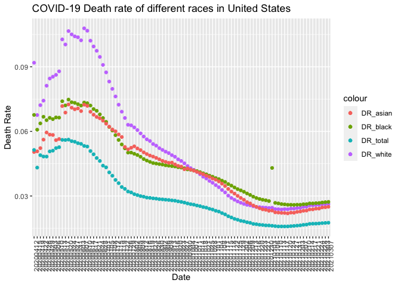
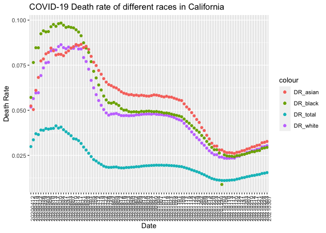

Midterm Project
================
NickyNie
10/20/2021

# Introduction

This dataset is a collaboration between the COVID Tracking Project and
the Boston University Center for Antiracist Research, which shows the
counts of cases/deaths of COVID-19 catrgotized by races for each state
in United States. The data was collected from April 12, 2020 to March
07, 2021.

## Main Question: Is death from COVID-19 associated with races?

#### Sub Questions:

#### 1.Are the trends of incidence/death of different races same across the year in the country level?

#### 2.Is the trend in CA similar to that in the country level?

#### 3.What are top 5 states with highest death rate from COVID-19 for different races?

#### 4.Which race with highest death rate in each state?

# Method

### Download data

I download data in csv form from The COVID Tracking Project
<https://covidtracking.com/race>

``` r
race <- fread("CRDT.csv")
```

### Preprocessing data

``` r
tab <- race[, .(
NA_total = sum(is.na(race$Cases_Total)),
NA_white = sum(is.na(race$Cases_White)),
NA_black = sum(is.na(race$Cases_Black)),
NA_latinx = sum(is.na(race$Cases_Latinx)),
NA_asian = sum(is.na(race$Cases_Asian)),
NA_AIAN = sum(is.na(race$Cases_AIAN)),
NA_NHPI = sum(is.na(race$Cases_NHPI)),
NA_multi = sum(is.na(race$Cases_Multiracial))
)]
knitr::kable(tab)
```

| NA\_total | NA\_white | NA\_black | NA\_latinx | NA\_asian | NA\_AIAN | NA\_NHPI | NA\_multi |
| --------: | --------: | --------: | ---------: | --------: | -------: | -------: | --------: |
|       232 |       652 |       733 |       3248 |       950 |     2057 |     3139 |      3795 |

Based on this table, I decided to take a close look at data of Total,
White, Black and Asian since races like Latinx, AIAN, NHPI and
multiracial have almost half of missing data, which is not suitable for
further analysis. And for the three races categories left, I dropped all
the NAs for further analysis.

I firstly created two new datasets, one is based on state(race\_state)
and another(race\_country) is based on country. Then I calculated death
rates based on races of each dataset. I also created a dataset of CA to
see if pattern in CA is similar to the pattern of the whole country. And
since the number of cases and deaths are cumulative, I chose the latest
data(2021.03.07) and created a new dataset called “latest” to find the
race with highest death rate in each state.

``` r
# pick up interested variables
race_state <- unique(race[,.(Date,State,Cases_Total,Cases_White,Cases_Black,Cases_Asian,Deaths_Total,Deaths_White,Deaths_Black,Deaths_Asian)])
# since date here shows to be integer, I changed them into str
race_state$Date <- as.character(race_state$Date)

# drop NAs
race_state <- race_state[!is.na(Cases_Total) & !is.na(Cases_White) & !is.na(Cases_Black) & !is.na(Cases_Asian) & !is.na(Deaths_Total) & !is.na(Deaths_White) & !is.na(Deaths_Black) & !is.na(Deaths_Asian)]
sum(is.na(race_state))
```

    ## [1] 0

``` r
# Calculate total cases of different races based on date
race_country <- race_state[,.(
  Case_total  = sum(Cases_Total),
  Case_white  = sum(Cases_White),
  Case_black  = sum(Cases_Black),
  Case_asian  = sum(Cases_Asian),
  Death_total = sum(Deaths_Total),
  Death_white = sum(Deaths_White),
  Death_black = sum(Deaths_Black),
  Death_asian = sum(Deaths_Asian)
), by = Date]

# Calculate death rate
race_state  [, DR_total := Deaths_Total/Cases_Total]
race_state  [, DR_white := Deaths_White/Cases_White]
race_state  [, DR_black := Deaths_Black/Cases_Black]
race_state  [, DR_asian := Deaths_Asian/Cases_Asian]
race_country[, DR_total := Death_total/Case_total]
race_country[, DR_white := Death_white/Case_white]
race_country[, DR_black := Death_black/Case_black]
race_country[, DR_asian := Death_asian/Case_asian]

# Stick to CA data
CA <- filter(race_state, State == "CA")

# Race with highest DR in each state.
latest <- filter(race_state, Date == "20210307")
latest <- latest[, highest_DR := 
         fifelse(DR_white == max(DR_white,DR_black,DR_asian),"White",
          fifelse(DR_black == max(DR_white,DR_black,DR_asian),"Black","Asian"
          )), by = State]
```

# Preliminary Results

``` r
ggplot(data = race_country) + 
  geom_point(mapping = aes(x = Date, y = DR_white, color = "DR_white"))+
  geom_point(mapping = aes(x = Date, y = DR_black, color = "DR_black"))+
  geom_point(mapping = aes(x = Date, y = DR_asian, color = "DR_asian"))+
  geom_point(mapping = aes(x = Date, y = DR_total,color = "DR_total"))+
  labs(x = "Date", y = "Death Rate")+
  labs(title = "COVID-19 Death rate of different races in United States")+
  theme(axis.text.x = element_text(angle=90, hjust=1, vjust=1))
```

<!-- -->

From this graph, we can see that the trend of all DR is gradually
decreasing, the total death rate is always the lowest one since there
are a lot of cases of other or unknown races which largely increase the
denominator. And although death rate of white is higher than the other
two races initially, they approach to the same level finally with a
little bit of difference.

``` r
ggplot(data = CA) + 
  geom_point(mapping = aes(x = Date, y = DR_white, color = "DR_white"))+
  geom_point(mapping = aes(x = Date, y = DR_black, color = "DR_black"))+
  geom_point(mapping = aes(x = Date, y = DR_asian, color = "DR_asian"))+
  geom_point(mapping = aes(x = Date, y = DR_total,color = "DR_total"))+
  labs(x = "Date", y = "Death Rate")+
  labs(title = "COVID-19 Death rate of different races in California")+
  theme(axis.text.x = element_text(angle=90, hjust=1, vjust=1))
```

<!-- -->

The general trend is similar to that of country but it seems that four
lines go up slightly at last. But we can still see a trend of DR of
three races approaching to the same level at the final stage of the
data.

``` r
top5_total <- latest[order(DR_total,decreasing = TRUE)][1:5]
top5_total
```

    ##        Date State Cases_Total Cases_White Cases_Black Cases_Asian Deaths_Total
    ## 1: 20210307    NJ      812609      268537       69860       30370        23574
    ## 2: 20210307    MA      591356      219467       35342       16039        16417
    ## 3: 20210307    CT      285330       85469       19651        3019         7704
    ## 4: 20210307    PA      948643      487131       81180       16176        24349
    ## 5: 20210307    MI      656072      378135       74321       10362        16658
    ##    Deaths_White Deaths_Black Deaths_Asian   DR_total   DR_white   DR_black
    ## 1:        12932         3743         1178 0.02901026 0.04815724 0.05357859
    ## 2:        12022         1069          414 0.02776162 0.05477817 0.03024730
    ## 3:         5413          906           83 0.02700032 0.06333290 0.04610452
    ## 4:        19497         2829          379 0.02566719 0.04002414 0.03484848
    ## 5:        11205         3634          179 0.02539051 0.02963227 0.04889601
    ##      DR_asian highest_DR
    ## 1: 0.03878828      Black
    ## 2: 0.02581208      White
    ## 3: 0.02749255      White
    ## 4: 0.02342977      White
    ## 5: 0.01727466      Black

``` r
top5_white <- latest[order(DR_white,decreasing = TRUE)][1:5]
top5_white
```

    ##        Date State Cases_Total Cases_White Cases_Black Cases_Asian Deaths_Total
    ## 1: 20210307    TX     2686818       25581       12672         933        44451
    ## 2: 20210307    CT      285330       85469       19651        3019         7704
    ## 3: 20210307    MA      591356      219467       35342       16039        16417
    ## 4: 20210307    NJ      812609      268537       69860       30370        23574
    ## 5: 20210307    PA      948643      487131       81180       16176        24349
    ##    Deaths_White Deaths_Black Deaths_Asian   DR_total   DR_white   DR_black
    ## 1:        18276         4252          898 0.01654411 0.71443650 0.33554293
    ## 2:         5413          906           83 0.02700032 0.06333290 0.04610452
    ## 3:        12022         1069          414 0.02776162 0.05477817 0.03024730
    ## 4:        12932         3743         1178 0.02901026 0.04815724 0.05357859
    ## 5:        19497         2829          379 0.02566719 0.04002414 0.03484848
    ##      DR_asian highest_DR
    ## 1: 0.96248660      Asian
    ## 2: 0.02749255      White
    ## 3: 0.02581208      White
    ## 4: 0.03878828      Black
    ## 5: 0.02342977      White

``` r
top5_black <- latest[order(DR_black,decreasing = TRUE)][1:5]
top5_black
```

    ##        Date State Cases_Total Cases_White Cases_Black Cases_Asian Deaths_Total
    ## 1: 20210307    TX     2686818       25581       12672         933        44451
    ## 2: 20210307    NJ      812609      268537       69860       30370        23574
    ## 3: 20210307    MI      656072      378135       74321       10362        16658
    ## 4: 20210307    CT      285330       85469       19651        3019         7704
    ## 5: 20210307    DC       41419       10708       20164         914         1030
    ##    Deaths_White Deaths_Black Deaths_Asian   DR_total    DR_white   DR_black
    ## 1:        18276         4252          898 0.01654411 0.714436496 0.33554293
    ## 2:        12932         3743         1178 0.02901026 0.048157237 0.05357859
    ## 3:        11205         3634          179 0.02539051 0.029632274 0.04889601
    ## 4:         5413          906           83 0.02700032 0.063332904 0.04610452
    ## 5:          105          773           14 0.02486781 0.009805753 0.03833565
    ##      DR_asian highest_DR
    ## 1: 0.96248660      Asian
    ## 2: 0.03878828      Black
    ## 3: 0.01727466      Black
    ## 4: 0.02749255      White
    ## 5: 0.01531729      Black

``` r
top5_asian <- latest[order(DR_asian,decreasing = TRUE)][1:5]
top5_asian
```

    ##        Date State Cases_Total Cases_White Cases_Black Cases_Asian Deaths_Total
    ## 1: 20210307    TX     2686818       25581       12672         933        44451
    ## 2: 20210307    HI       27891        3646         580        6068          445
    ## 3: 20210307    NJ      812609      268537       69860       30370        23574
    ## 4: 20210307    CA     3501394      546630      111279      186562        54124
    ## 5: 20210307    MD      387319      134697      112033        8867         7955
    ##    Deaths_White Deaths_Black Deaths_Asian   DR_total   DR_white    DR_black
    ## 1:        18276         4252          898 0.01654411 0.71443650 0.335542929
    ## 2:           40            4          244 0.01595497 0.01097093 0.006896552
    ## 3:        12932         3743         1178 0.02901026 0.04815724 0.053578586
    ## 4:        16586         3275         6105 0.01545784 0.03034228 0.029430530
    ## 5:         4078         2736          277 0.02053863 0.03027536 0.024421376
    ##      DR_asian highest_DR
    ## 1: 0.96248660      Asian
    ## 2: 0.04021094      Asian
    ## 3: 0.03878828      Black
    ## 4: 0.03272371      Asian
    ## 5: 0.03123943      Asian

The top5 states with highest death rate of total are NJ, MA, CT, PA, MI

The top5 states with highest death rate of white are TX, CT, MA, NJ, PA

The top5 states with highest death rate of black are TX, NJ, MI, CT, DC

The top5 states with highest death rate of asian are TX, HI, NJ, CA, MD

``` r
tab <- latest[, .(
  N_states  = .N,
  avg_DR_white = mean(DR_white),
  avg_DR_black = mean(DR_black),
  avg_DR_asian = mean(DR_asian)
), by = highest_DR]

knitr::kable(tab)
```

| highest\_DR | N\_states | avg\_DR\_white | avg\_DR\_black | avg\_DR\_asian |
| :---------- | --------: | -------------: | -------------: | -------------: |
| Asian       |         6 |      0.1330899 |      0.0676491 |      0.1811356 |
| White       |        30 |      0.0249392 |      0.0159199 |      0.0143990 |
| Black       |        11 |      0.0236851 |      0.0304532 |      0.0152750 |

# Conclusion

Just from these data, I think there is no clear association between
races and death rate of COVID-19. Both in CA and country level, the
death rate of all three races approach to the same level finally. And
for top5 states with highest death rate in each race, TX is top1 of all
three races and MA, NJ, CT, PA, MI also appear more than one time.
Hence, in my opinion, the death rate is highly depend on the action of
the State rather than races, for example, the burden of medical system,
the policy to restrict COVID-19 etc. Although the number of states with
DR\_white to be the highest DR among three races is greatest (30), the
difference among average DR is not that so great. This probably is
caused by samples collection. The majority of United States population
is white, hence the data collected in white might be greater, leading to
a relatively higher DR. I saw a lot of data showed a different result
from these data, which indicated that death rate of black is highest
among all races. That might be caused by inequality of medical
distribution at the stage of onset of COVID-19. As the burden of medical
resource relieved and government took action to restrict COVID-19 and
gave supports to citizens, I believe that death rate that approaches to
the same level is a right trend.
